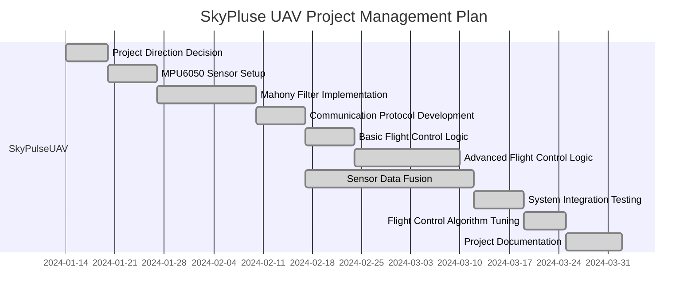

# Meeting Minutes

### Project GANNT Chart

## Meeting No.1

| Item              | Details              |
| ----------------- | -------------------- |
| **Meeting Title** | Meeting Title	Discussion on Project Direction and Topics |
| **Meeting Date**  | June 6, 2024 |
| **Participants**  | Mahmud Sani Zango, Yuxuan Han, Binhan Tian  |

### Meeting Content

#### 1. Discussion on Project Topics
Discussed the use of a swarm of Nano drones by sharing visuals among the drones, 3D graphics are constructed on a host machine. This technology can be applied to various scenarios, such as real-time monitoring and disaster area assessment. 

#### 2.	Application of Dual Vision Cameras

Explored the implementation of object following and obstacle avoidance features in drones using dual vision cameras. This technology enhances the autonomy and safety of drones in complex and dynamically changing environments, making it particularly suitable for tasks in challenging settings. 

#### 3.	Combination of AI and Deep Learning with a Monocular Camera

Discussed the implementation of object following and obstacle avoidance using a monocular camera integrated with AI and deep learning. The advantage of this technology lies in reducing hardware costs while improving recognition and response speeds through algorithm optimization. 

### Completed Activities This Week

- Hardware and software support for Crazyflie drones was studied
- Research on swarm theory and related essays are examined
- Research on obstacle avoidance and path planning algorithms

### Upcoming Activities – Next Week

- Research on using MATLAB for drone simulation
- Building a PyTorch environment

### Issues, Risks and Concerns

Nothing

## Meeting No.2

| Item     | Details              |
| -------- | -------------------- |
| **Meeting Title** | Finalization of Project Topic and Collection Crazyflie Drone Hardware |
| **Meeting Date**  | June 13, 2024 |
| **Participants**  | Mahmud Sani Zango, Yuxuan Han, Binhan Tian |

### Meeting Content

#### 1. Finalization of the Project Topic 
The project will focus on using a monocular camera combined with AI for obstacle avoidance and object tracking. 

#### 2. Filling Out Equipment Collection
Completed the forms to collect the Crazyflie drones and associated hardware. 

#### 3. Discussion about Amendments to the Proposal
The project proposal may contain misleading descriptions. Discussion of changes to specific parts of the project proposal. And advice on how to complete the risk assessment section. 

### Completed Activities This Week

- Learning MATLAB and Simulink: continued to enhance the proficiency with MATLAB and Simulink
- Research on Deep learning and image recognition
- Attempts to set up a deep learning framework

### Upcoming Activities – Next Week

- Testing the Crazyflie Drone’s Wi-Fi communication Module
    - Prioritize the implementation of the drone’s communication functions to ensure proper hardware interaction. 
- Using MATLAB for Image Recognition and Processing
    - Begin testing image processing and recognition algorithms to ensure their effectiveness and accuracy. 

### Issues, Risks and Concerns

Nothing

## Meeting No.3

| Item              | Details              |
| ----------------- | -------------------- |
| **Meeting Title** |  |
| **Meeting Date**  |  |
| **Participants**  | Mahmud Sani Zango, Yuxuan Han, Binhan Tian  |
