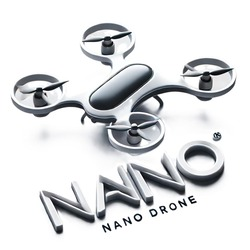

# MSc Project: Autonomous Control for Nano Drones

<div align="center">
    
    <p>
      <i align="center">Pioneering UAV Technology for Critical Missions 🚀</i>
    </p>
    <div id="badges">
     <a href="GitHub License"></a>
     <a href="Contributions welcome"></a>
     <a href="https://github.com/Tony-Btian/SkyPulseUAV/issues"></a>
     <a href="https://github.com/Tony-Btian/SkyPulseUAV"></a>
     <a href="https://github.com/Tony-Btian/SkyPulseUAV"></a>
    </div> 
	<br>
</div>

## Introduction
With the rapid development of UAV (Unmanned Aerial Vehicle) and sensor technology, nano drones such as Crazyflie are widely used in surveillance, reconnaissance, entertainment, environmental data collection and other fields due to their advantages of compact size, high flexibility and low cost. The autonomous operation of UAVs has become an important development direction for UAV control, and object tracking, obstacle avoidance are the keys to achieving autonomous operation. Traditional obstacle avoidance methods rely on LiDAR, ultrasonic, ToF, and infrared sensors. However, these sensors are usually large, costly energy-consuming and unsuitable for compact nano-drones. 

With advances in computer vision and deep learning, combining monocular visual information with AI judgement for obstacle avoidance provides a cost-effective and compact solution for Nano drones. The visual information provides rich details of the environment depth information, and object features through image processing and deep learning algorithms enabling the system to perform simultaneous applications with obstacle recognition and object tracking. 

This project aims to develop a monocular vision-based obstacle avoidance and object tracking system using the Crazyflie Nano drone equipped with AI Deck. Crazyflie nano drone is a lightweight, open-source platform known for its versatility and ease of enactment, which makes it a good choice for research and development projects. In addition, the AI Deck is an extension platform for Crazyflie, with a GAP8 RISC-V-based AI accelerator on board that enhances the computational power of the drone, enabling it to run complex algorithms. 

The successful implementation of this project will demonstrate the feasibility and effectiveness of monocular vision-based systems for autonomous UAV navigation and tracking. By enabling real-time obstacle avoidance and object tracking, the project will enhance the capabilities of small UAVs, making them more versatile and robust for a wide range of applications. In addition, the project will contribute to the ongoing development of computer vision and autonomous systems research, providing valuable insights and potential solutions for future developments in the field.

## Resources required
### 1.	Hardware
- Development PC: For developing and training neural network models. A graphics card may be required to improve deep learning model training efficiency.
- Crazyflie Nano Drones: The primary hardware platform for the project.
- AI Deck: An AI extension board for Crazyflie, which includes a GAP8 RISC-V-based AI accelerator.
- Flow Deck: For stabilizing the fuselage.
- Crazyradio 2.0: Provides a module for Wi-Fi communication to the host computer.

### 2.	Software
- MATLAB/Simulink: Simulation and algorithm development
- Computer Vision Libraries: OpenCV for image processing tasks.
- Crazyflie API and SDK: For interfacing with the drone and controlling its operations. 

# Features of Nano Drone Simulator
The

# Usage
### Installation
Dependency packages that Ubuntu systems may need.
```Bash
sudo apt-get install xcb-cursor0 libxcb-cursor0
```
Installation in a virtual environment.
```Bash
git clone https://github.com/Tony-Btian/MSc_Project.git
cd MSc_Project
pip install -r requirements.txt
```
or 

```Bash
pip3 install PySide6 numpy==1.26.4 pandas opencv-python timm
pip3 install torch torchvision torchaudio --index-url https://download.pytorch.org/whl/cu121
```
